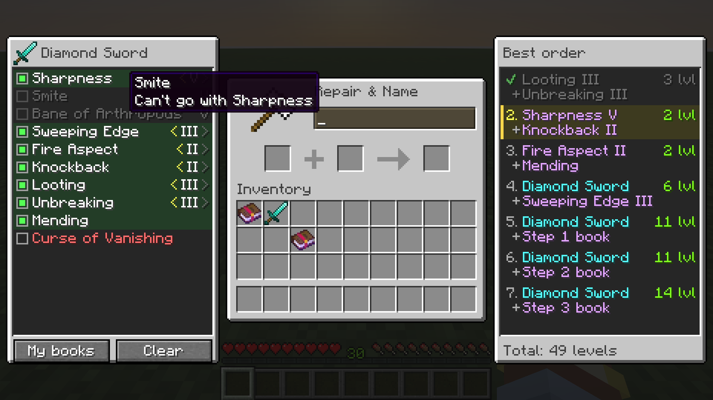
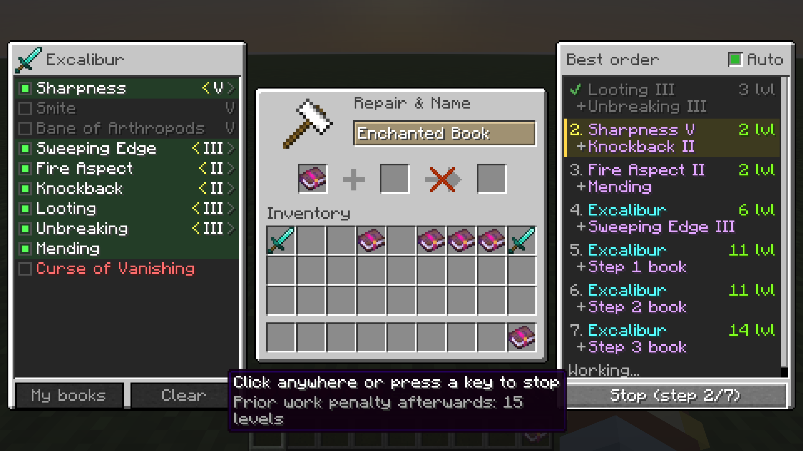

# Enchant Order

A Fabric mod for Minecraft **26.2** that tells you the cheapest order to put enchanted books on an item, right next to the anvil.
It does the same job as the [Minecraft Enchantment Order Calculator](https://iamcal.github.io/enchant-order/), but in the game, using the item you're actually holding.

## How to use it

1. Open an anvil and put a tool, weapon or piece of armor in the **first slot**.
2. A panel shows up on the **left** with every enchantment that fits the item. Click the ones you want.
   - Enchantments that can't go together (like Sharpness and Smite) get greyed out as soon as you pick one of them.
   - Everything starts at its highest level. If your book is a lower level, use the little `<` `>` arrows.
   - **My books** ticks every enchantment you have a book for in your inventory.
   - **Clear** unticks everything.
3. The panel on the **right** shows the cheapest order, step by step:
   - The top line of each step goes in the anvil's **first slot**, and the line starting with `+` goes in the **second slot**.
   - "Step 2 book" means the book you made in step 2.
   - The cost is green if you have enough levels and red if you don't.
   - The step you should do next is highlighted in yellow. Steps you've finished get a ✔ automatically.
   - Hover over a step to see exactly what goes where, and what's on the books you combined earlier.
4. Do the steps in order. You can take the item out of the anvil to combine books and the plan stays on screen.
   You can even close the anvil and come back later.

The order puts all the book-on-book steps first, so once the item goes in the first slot it can stay there until the end.

## Let it do the steps for you (Auto)

Tick the **Auto** box in the top right corner of the order panel. An **Apply** button shows up under the steps.

1. Put the item in the anvil and tick your enchantments (**My books** is the quickest way).
2. Click **Apply**. The mod shift-clicks the books and the item into the anvil and takes each result out, step by step, just like you would.
   You can watch the steps tick off as it goes. A full sword takes a few seconds.

Apply only works when:

- every book the plan needs is in your inventory or hotbar (single-enchantment books at the levels you ticked; the off-hand doesn't count), and
- you have enough levels for **all** the remaining steps, so it never stops halfway because you ran out.

If something is missing, the button says so (for example "Need 49 levels" or "Missing books"). Hover over it to see exactly what.

It only ever uses the exact item you planned with, never a spare copy of it from your inventory.
If you've used or renamed the item since you planned, the button says "Put item in anvil": do that, and the plan follows it.
Before taking each result it checks that the anvil asks the price the plan says. If not, it stops before paying and tells you why under the steps.
Anything typed in the anvil's name box is cleared first, so it never renames your item for an extra level.
If the item was repaired, or you did a step by hand with a different copy of a book, the planned prices no longer match:
the total turns red, and the button says "Wrong work penalty" instead of letting Auto start.

Clicking anywhere or pressing a key (or closing the anvil) stops it straight away. Nothing is lost: the plan remembers which steps are done,
so you can click Apply again later to carry on. That includes when an anvil wears out and breaks halfway.
The box stays ticked until you untick it, even after restarting the game.

Apply waits until you click it, so it never starts while you're still ticking enchantments.

## How it works out the order

Every time you use an anvil it costs:

- the **prior work penalty** of the item in the first slot, plus
- the prior work penalty of the item in the second slot, plus
- the enchantments on the second item (each enchantment's level times its book cost).

Each use also raises the penalty of the result (0 → 1 → 3 → 7 → 15 → 31 levels), so the order matters a lot.
Combining books with each other first keeps the penalties low.
Any single step costing 40 levels or more is "Too Expensive!" in survival.

The mod tries every possible way of pairing up the books and keeps the one with the **fewest total levels**.
If two orders cost the same, it picks the one that leaves the lowest work penalty on the finished item, then the one with the smallest single steps.
The enchantment data (max levels, book costs, which ones clash) comes straight from the game, so enchantments added by data packs or other mods work too.

If a book in your inventory has been through an anvil before (it has its own work penalty), the plan uses that book's real penalty, so the costs match what the anvil asks for.
Books you don't have yet are assumed to be fresh. Renaming the item also costs 1 extra level on that step.

## Installing

1. Install [Fabric Loader](https://fabricmc.net/use/) for Minecraft 26.2.
2. Put **Fabric API** (for 26.2) in your `mods` folder.
3. Put `enchantorder-1.0.0.jar` in your `mods` folder too.

The mod only changes your game window, so it works on any server, including ones without the mod. Auto mode just sends the same clicks you would make yourself.

### Getting the jar

- **Easiest:** every push to GitHub builds the mod automatically. Open the **Actions** tab, click the latest **build** run,
  and download the **Artifacts** zip at the bottom. The jar inside it (the one *without* `-sources`) is the mod.
- **On your own computer:** install Java 25, then run `./gradlew build` (on Windows: `gradlew.bat build`).
  The jar ends up in `build/libs/`.

If the panels look squashed, your window is too narrow for them at your GUI scale. Try a smaller **GUI Scale** in Video Settings.

## Where things are

| File | What it does |
| --- | --- |
| `src/main/java/com/enchantorder/plan/AnvilOptimizer.java` | The calculator. Plain Java with no Minecraft code, so it can be tested on its own |
| `src/test/java/com/enchantorder/plan/AnvilOptimizerTest.java` | Tests that check the calculator against trying every order the slow way |
| `src/client/java/com/enchantorder/EnchantOrderClient.java` | Starts the mod and adds the panels whenever an anvil opens |
| `src/client/java/com/enchantorder/client/AnvilPlanner.java` | Remembers the item and the ticked enchantments, runs the calculator, and checks off finished steps |
| `src/client/java/com/enchantorder/client/AnvilOverlay.java` | Places the panels next to the anvil and sends them your clicks and scrolling |
| `src/client/java/com/enchantorder/client/PickerPanel.java` | The left panel (picking enchantments) |
| `src/client/java/com/enchantorder/client/OrderPanel.java` | The right panel (the order) |
| `src/client/java/com/enchantorder/client/PanelWidget.java` | The grey panel look, scrolling and buttons shared by both panels |
| `src/client/java/com/enchantorder/client/AutoEnchanter.java` | Auto mode: does the anvil steps for you with shift-clicks, and stops if anything looks wrong |
| `src/client/java/com/enchantorder/client/EnchantOrderSettings.java` | Remembers whether the Auto box is ticked (in `config/enchantorder.properties`) |
| `src/client/resources/assets/enchantorder/lang/en_us.json` | All the text the mod shows |
| `src/gametest/java/com/enchantorder/client/EnchantOrderClientGameTest.java` | An automatic test that starts the real game, opens an anvil and clicks through the panels. GitHub runs it on every push and saves screenshots (the **Screenshots** artifact) |

## Ideas for later

- Use books with more than one enchantment on them as a starting point.
- Plan with a lower-level book you have (two Sharpness IV books make a Sharpness V).
